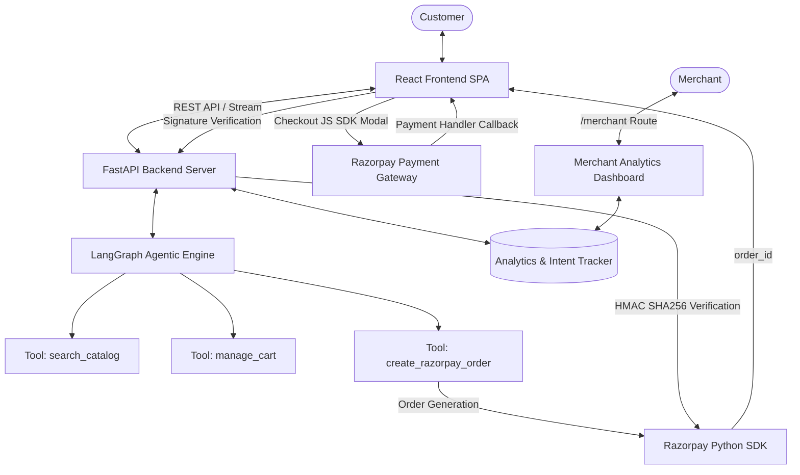

# Implementation Plan — RazorFlow AI: Intelligent Agentic Commerce Platform

Building an end-to-end prototype for the **Razorpay AI Buildathon (Track 1: AI Growth & Agentic Commerce)**. RazorFlow AI is an autonomous, conversational e-commerce platform powered by LangGraph, FastAPI, React, and Razorpay Checkout JS SDK.

---

## User Review Required

> [!IMPORTANT]
> - **Razorpay API Keys:** The backend will support live `RAZORPAY_KEY_ID` and `RAZORPAY_KEY_SECRET` from environment variables (`.env`). If not provided or invalid, it gracefully falls back to generating valid synthetic test mode orders (`order_test_...`) so that the prototype and payment flow work out of the box without requiring manual setup.
> - **LLM Provider:** The LangGraph agent supports Gemini / OpenAI / LangChain standard models via environment keys (`GEMINI_API_KEY`, `OPENAI_API_KEY`). A robust local rule-based intent fallback engine is also integrated to ensure zero-downtime execution even without API keys.

---

## Proposed System Architecture



---

## Proposed Changes

### Backend (`/backend`)

#### [NEW] [config.py](file:///d:/Khushi/RazorFlow_AI/backend/app/config.py)
- Load environment variables (`RAZORPAY_KEY_ID`, `RAZORPAY_KEY_SECRET`, `GEMINI_API_KEY`, `OPENAI_API_KEY`, `PORT`).
- Default configuration settings and secret key fallbacks.

#### [NEW] [catalog.json](file:///d:/Khushi/RazorFlow_AI/backend/app/catalog.json)
- Structured product database (laptops, accessories, audio, wearables, office tech) with IDs, names, prices (in INR & paise), categories, tags, specifications, ratings, stock, and high-resolution image URLs.

#### [NEW] [agent/state.py](file:///d:/Khushi/RazorFlow_AI/backend/app/agent/state.py)
- LangGraph state definitions (`AgentState` containing messages, cart items, budget limit, confirmation_required flag, active_order).

#### [NEW] [agent/tools.py](file:///d:/Khushi/RazorFlow_AI/backend/app/agent/tools.py)
- Tool `search_catalog(query, max_price, category)`: Semantic & keyword filtering against `catalog.json`.
- Tool `manage_cart(action, product_id, quantity)`: Add/remove items and calculate total value in INR and paise.
- Tool `create_razorpay_order(amount_paise, currency)`: Generates Razorpay order via SDK.

#### [NEW] [agent/graph.py](file:///d:/Khushi/RazorFlow_AI/backend/app/agent/graph.py)
- LangGraph workflow definition with StateGraph, tool node, decision nodes, and **Deterministic Payment Guardrail** (interrupts or requires user confirmation before `create_razorpay_order` execution).

#### [NEW] [services/razorpay_service.py](file:///d:/Khushi/RazorFlow_AI/backend/app/services/razorpay_service.py)
- `RazorpayService` handling order creation and HMAC-SHA256 signature verification.

#### [NEW] [services/analytics_service.py](file:///d:/Khushi/RazorFlow_AI/backend/app/services/analytics_service.py)
- `AnalyticsService` tracking customer intent keywords, conversation conversion funnel, top recommended bundles, and generating AI growth insights.

#### [NEW] [routes/chat.py](file:///d:/Khushi/RazorFlow_AI/backend/app/routes/chat.py)
- POST `/api/chat`: Process user messages, update conversational state, invoke LangGraph workflow, return AI agent responses + structured cards.

#### [NEW] [routes/cart.py](file:///d:/Khushi/RazorFlow_AI/backend/app/routes/cart.py)
- GET `/api/cart`: Fetch current cart state.
- POST `/api/cart/item`: Add/update item in cart.
- DELETE `/api/cart/item/{product_id}`: Remove item from cart.

#### [NEW] [routes/payment.py](file:///d:/Khushi/RazorFlow_AI/backend/app/routes/payment.py)
- POST `/api/payment/create-order`: Generate Razorpay order ID.
- POST `/api/payment/verify`: Verify payment signature (`razorpay_payment_id`, `razorpay_order_id`, `razorpay_signature`).

#### [NEW] [routes/merchant.py](file:///d:/Khushi/RazorFlow_AI/backend/app/routes/merchant.py)
- GET `/api/merchant/metrics`: Returns intent keywords, conversion stats, total revenue, and AI-suggested bundle campaigns.

#### [NEW] [main.py](file:///d:/Khushi/RazorFlow_AI/backend/app/main.py)
- Entry point for FastAPI application, registering CORS middleware and route routers.

---

### Frontend (`/frontend`)

#### [NEW] [package.json](file:///d:/Khushi/RazorFlow_AI/frontend/package.json) & [vite.config.js](file:///d:/Khushi/RazorFlow_AI/frontend/vite.config.js)
- Vite + React configuration with proxy to backend port `8000`. Dependencies: `react-router-dom`, `axios`, `lucide-react`, `tailwindcss`.

#### [NEW] [index.css](file:///d:/Khushi/RazorFlow_AI/frontend/src/index.css) & [tailwind.config.js](file:///d:/Khushi/RazorFlow_AI/frontend/tailwind.config.js)
- Glassmorphism design system, dark mode custom variables, vibrant gradient accents (Razorpay Blue & Emerald Glow), smooth animations.

#### [NEW] [App.jsx](file:///d:/Khushi/RazorFlow_AI/frontend/src/App.jsx)
- SPA Router setup: `/` for Customer Conversational E-Commerce, `/merchant` for Merchant Growth Dashboard.

#### [NEW] Components
- `Navbar.jsx`: Brand header, navigation tabs, cart counter badge, quick action buttons.
- `Chat/ChatContainer.jsx`: Customer chat interface with dynamic quick prompt pills ("Find laptops for coding under ₹60,000", "Show me noise-cancelling headphones", etc.).
- `Chat/MessageList.jsx` & `ProductCard.jsx`: Inline interactive product cards, price tags, "Add to Cart" and "Buy Now" triggers.
- `Chat/PaymentConfirmModal.jsx`: Human-in-the-loop payment confirmation modal displaying order details before calling `create_razorpay_order`.
- `Cart/CartDrawer.jsx`: Slide-over cart breakdown with currency sub-unit displays (in INR & Paise) and checkout action.
- `Merchant/Dashboard.jsx`, `KeyMetrics.jsx`, `IntentChart.jsx`, `CampaignCard.jsx`: Growth insights dashboard with intent analytics, conversion metrics, and AI bundle launcher.

---

## Verification Plan

### Automated Tests & Checks
1. **Backend Verification:**
   - Run Python syntax checks and FastAPI server startup:
     ```powershell
     cd backend
     python -m app.main
     ```
   - Verify health check endpoint `http://127.0.0.1:8000/` and REST endpoints.
2. **Frontend Build & Lint:**
   - Validate React components compile without errors:
     ```powershell
     cd frontend
     npm run build
     ```

### Manual Verification
1. **Catalog Search & Recommendations:**
   - Query "Find laptops for coding under ₹60,000" in Customer Chat. Verify budget-aware product cards render with accurate pricing.
   - Verify cross-selling recommendation triggers (e.g. suggesting sleeve/mouse within budget).
2. **Deterministic Guardrail & Human-in-the-Loop:**
   - Ask agent to buy a product. Ensure agent prompts user for confirmation ("Confirm Payment of ₹... for [Product]") before executing order creation.
3. **Razorpay Checkout Modal & Payment Verification:**
   - Click "Proceed to Pay". Verify Razorpay Checkout JS modal opens with `order_id`.
   - Submit test payment. Verify backend verifies HMAC signature and appends payment receipt card in chat.
4. **Merchant Dashboard:**
   - Navigate to `/merchant`. Verify real-time top search intents, conversion funnel metrics, and AI bundle campaigns.
